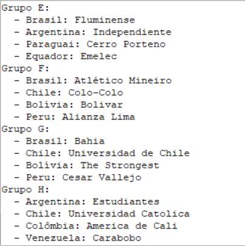

# Sorteio da Taça Libertadores

O **Sorteio da Taça Libertadores** é um procedimento vital para a Taça Libertadores, um dos torneios de clubes mais prestigiados da América do Sul. Sua função principal é a composição dos grupos, onde as equipes se enfrentarão na competição. A motivação por trás do sorteio é garantir que a Taça Libertadores seja emocionante, justa e verdadeiramente representativa da diversidade do futebol sul-americano.

## Função

O Sorteio da Taça Libertadores desempenha um papel crucial em vários aspectos:

1. **Equilíbrio Competitivo**: A função primordial é criar grupos equilibrados. Isso assegura que cada grupo tenha times de diferentes níveis de habilidade, evitando que grupos sejam excessivamente fortes ou fracos. Isso leva a partidas mais competitivas e emocionantes.

2. **Diversidade Geográfica**: A Taça Libertadores envolve times de diversos países da América do Sul. O sorteio garante que os grupos representem essa diversidade geográfica, com equipes de diferentes nações competindo entre si.

3. **Evitar Confrontos Internos Precoces**: Para manter o torneio interessante e adiar confrontos entre times do mesmo país, a regra de que equipes do mesmo país não podem ficar no mesmo grupo é aplicada. Isso cria a possibilidade de emocionantes embates nacionais nas fases posteriores.

## Motivação

A motivação por trás do Sorteio da Taça Libertadores é:

- **Entretenimento**: Proporcionar entretenimento de alta qualidade para torcedores de futebol. O sorteio cria expectativa e antecipação para o torneio, com fãs ansiosos para ver quais equipes se enfrentarão.

- **Justiça Competitiva**: Garantir que o torneio seja justo e que todos os times tenham a oportunidade de competir em condições igualitárias.

- **Promoção do Futebol Sul-Americano**: Destacar a diversidade e o talento no futebol sul-americano, promovendo a região como um importante centro de futebol.

O Sorteio da Taça Libertadores é muito mais do que um procedimento burocrático; é o começo de uma jornada emocionante para as equipes e uma celebração do esporte em toda a América do Sul.

## Fluxograma e Diagrama de classes e relacionamentos

Vide arquivos no repositório: Fluxograma.png e Diagrama_de_classes_e_relacionamentos.png

## Execução de Tutorial com Resumo Descritivo/Explicativo

Este tutorial explica como executar e utilizar o projeto **Sorteio da Taça Libertadores**. Siga as instruções abaixo para começar.

### Pré-Requisitos

Antes de começar, certifique-se de que seu ambiente atenda aos seguintes pré-requisitos:

- **Python**:  Certifique-se de que você tenha o Python 3 ou superior instalado no seu sistema. Você pode baixar a versão mais recente em [python.org](https://www.python.org/downloads/).

- **Bibliotecas Python**:  O projeto utiliza várias bibliotecas Python, incluindo `random`, `tkinter`, `Pillow (PIL)`, e `os`. Se você ainda não possui essas bibliotecas instaladas, você pode instalá-las usando o `pip` com os seguintes comandos:

  ```bash
  pip install random
  pip install tkinter
  pip install Pillow
  pip install os

### Como Executar o Projeto

- **Clone o Repositório**: Comece clonando este repositório para o seu computador: git clone https://github.com/Inacio21026/INACIO_libertadores.git

- **Navegue até o Diretório do Projeto**: Use o terminal (ou prompt de comando) para entrar no diretório do projeto: cd PEEInácio.py

- **Execute o Projeto**: Agora, você pode executar o projeto com o seguinte comando: python sorteio_libertadores.py

- **Interaja com a Interface**: Siga as instruções na interface gráfica para escolher os times, realizar o sorteio e visualizar os resultados.

## Notas Adicionais
- **1**: O usuário pode escolher até 8 times por país para um total de 32 times no sorteio.
- **2**: Se o usuário quiser selecionar mais de um time por vez, basta separar os nomes dos times por vírgulas.
- **3**: Clique no botão "Realizar Sorteio" para gerar os grupos da Taça Libertadores.
- **4**: O resultado do sorteio será exibido na interface.

## Demonstração do Aplicativo

Aqui estão algumas capturas de tela do Sorteio da Taça Libertadores em ação:


*Tela Inicial que da as instruções ao usuário.*


*Aqui, o usuário seleciona 32 times e realiza o sorteio, lembre-se que os times para o usuário escolher no aplicativo são só os principais de cada país, mas o usuário pode digitar na aba dos times o nome de algum clube em específico. Também cabe ressaltar, como já explicado anteriormente, o usuário pode selecionar mais de 1 time por vez, após escolher o país, o usuário pode escrever na aba dos time da seguinte forma: 'Fluminense,Palmeiras,Gremio,a,b,c' dessa forma ao clicar em adicionar time, 6 times serão adicionados de uma vez e o aplicativo reconhecerá 'a', 'b' e 'c' como times reais do Brasil, isso aumenta a liberdade do usuário.*



*Resultado do sorteio*

## Participante

INÁCIO